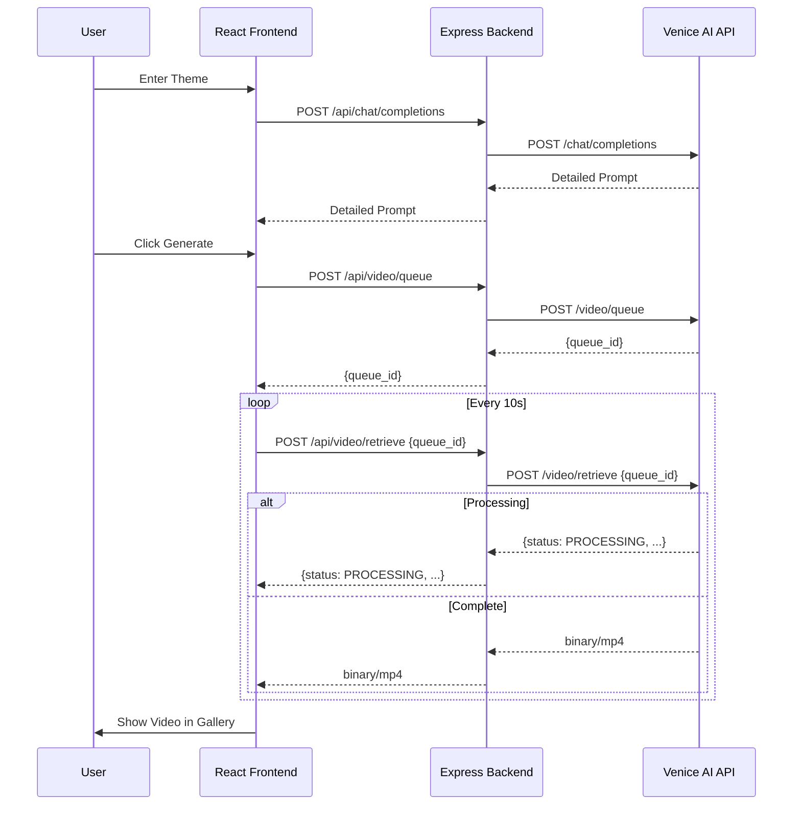

# Venice Music Video Studio - Implementation Plan

This document outlines the step-by-step implementation plan for the Venice Music Video Studio, a web-based application for end-to-end music video creation using the Venice AI Video Generation API.

## 1. Project Structure Setup

### 1.1 Backend (Express)
- Initialize the server directory if not already structured.
- Ensure `server.js` is the entry point.
- Configure `dotenv` for environment variables.
- Set up basic Express middleware (CORS, JSON parsing).

### 1.2 Frontend (React + Vite)
- Create a `client/` directory using Vite: `npm create vite@latest client -- --template react`.
- Install Tailwind CSS and its dependencies.
- Install UI libraries: `lucide-react`, `@radix-ui/react-*`, `clsx`, `tailwind-merge`.
- Install state management/data fetching: `tanstack/react-query` or `axios`.

### 1.3 Root Configuration
- Update root `package.json` to manage both client and server (using `concurrently` or similar).
- Create a `.env.example` file.

## 2. Backend API Proxy Implementation

The backend will act as a secure proxy to the Venice AI API (`https://api.venice.ai/api/v1`).

### 2.1 Authentication & Configuration
- Implement a central Venice API client using `axios`.
- Inject `Authorization: Bearer ${process.env.VENICE_API_KEY}` into all outgoing requests.

### 2.2 Endpoints
- `POST /api/chat/completions`: Proxy for theme-to-prompt conversion.
- `POST /api/video/queue`: Proxy for submitting generation requests.
- `POST /api/video/retrieve`: Proxy for polling status and retrieving MP4 data.
  - *Note:* Must handle both JSON (status) and binary (MP4) responses.
- `POST /api/video/quote`: Proxy for cost estimation.
- `POST /api/video/complete`: Proxy for manual cleanup (if not using `delete_media_on_completion`).

## 3. Frontend Component Development

### 3.1 Theme-to-Prompt Engine
- **Component:** `ThemeInput.jsx`
- **Logic:** User enters a simple theme (e.g., "Cyberpunk Neon City"). Frontend calls `/api/chat/completions` with a system prompt to generate a detailed video prompt.

### 3.2 Model & Parameter Configuration
- **Component:** `GeneratorConfig.jsx`
- **Features:**
  - Model Selector (Grouped: Text-to-Video, Image-to-Video).
  - Duration Slider/Select (4s, 8s, 10s, etc.).
  - Aspect Ratio Toggle (16:9, 9:16, 1:1).
  - Resolution Picker (720p, 1080p).
  - Cost Preview (calls `/api/video/quote` on change).

### 3.3 Queue Dashboard
- **Component:** `QueueList.jsx`
- **Logic:** Maintains a list of active generations.
- **Progress:** Uses `average_execution_time` and `execution_duration` from the API to show a progress bar.

### 3.4 Media Gallery
- **Component:** `VideoGallery.jsx`
- **Features:**
  - Grid view of completed videos.
  - In-app video player.
  - Download button.

## 4. Video Generation Workflow Integration

### 4.1 The "Generate" Flow
1. User clicks "Generate".
2. Frontend sends prompt and config to `/api/video/queue`.
3. Backend returns `queue_id`.
4. Frontend adds a new entry to the `QueueDashboard` state.

### 4.2 Polling Logic
- Implement a polling hook (e.g., using `useQuery` with `refetchInterval`).
- Poll `/api/video/retrieve` every 10 seconds.
- If response is JSON with `status: "PROCESSING"`, update progress.
- If response is binary (MP4), stop polling, save the blob, and move to `MediaGallery`.

## 5. Security & Deployment

### 5.1 Security
- Ensure `VENICE_API_KEY` is never exposed to the frontend.
- Implement basic rate limiting on the Express server.
- Sanitize user inputs before sending to the Chat API.

### 5.2 Deployment (Railway)
- Create a `Dockerfile` that builds the React frontend and serves it via the Express backend (or as a static site).
- Configure Railway environment variables.
- Set up a `healthcheck` endpoint.

## 6. Mermaid Workflow Diagram

