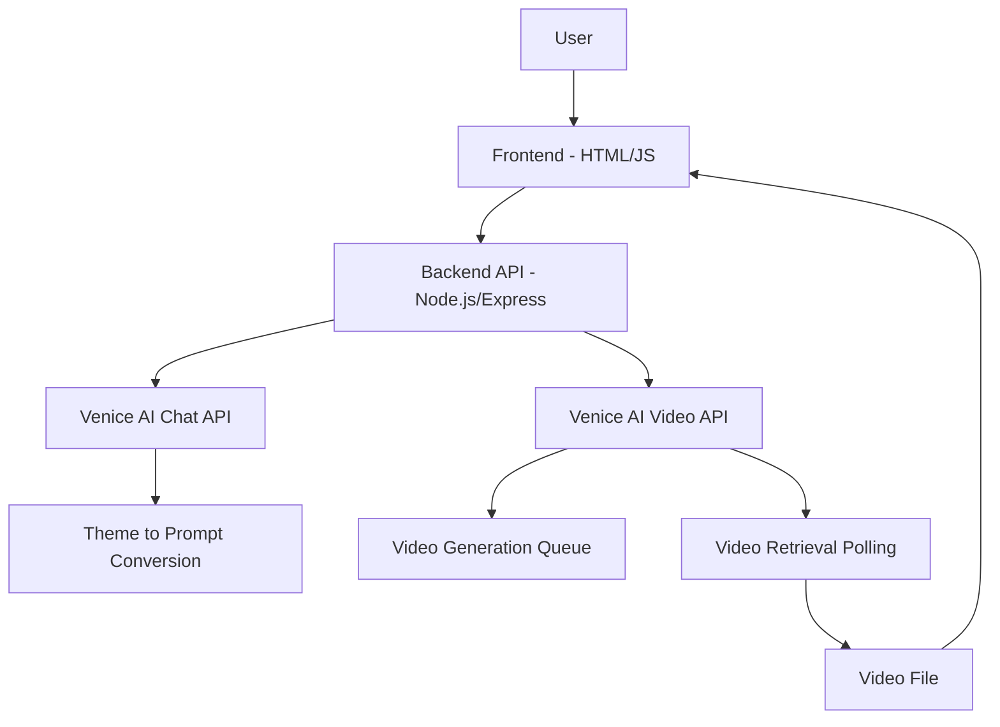
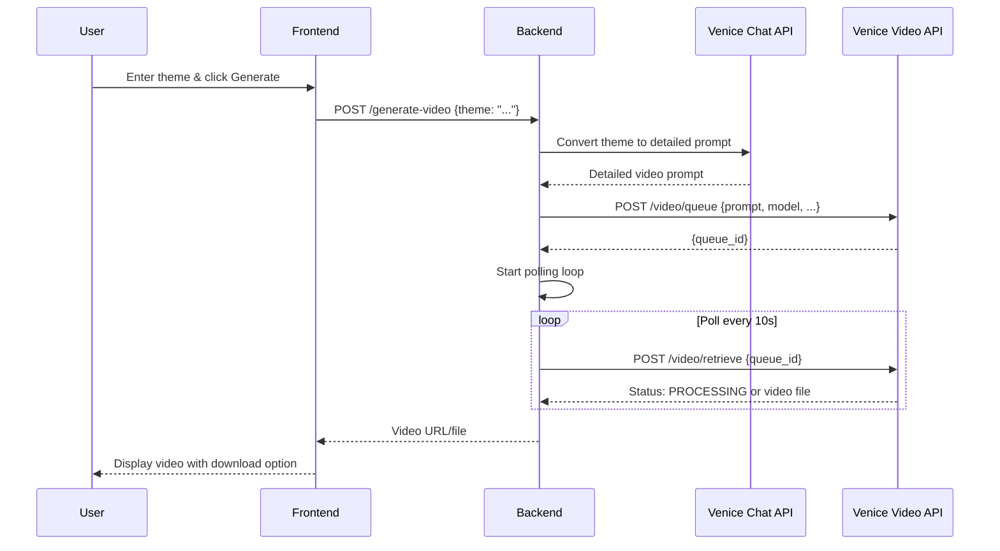

# Music Video Generation Interface - Architecture Plan

## Overview
Create a simple single-page web application that allows users to input a theme and generate a music video using Venice AI APIs. The app will convert the theme into a video generation prompt, queue the video creation, poll for completion, and display the result.

## System Architecture

## Components

### Frontend (Vanilla HTML/CSS/JS)
- **Single HTML page** with minimal styling
- **Input field** for theme description
- **Generate button** with loading states
- **Progress indicator** showing generation status
- **Video display area** with download link
- **Error handling** with user-friendly messages

### Backend (Node.js/Express)
- **REST API endpoint** `/generate-video` accepting theme
- **Theme processing** using Venice AI chat completions to create detailed video prompts
- **Video generation orchestration**:
  - Queue video generation request
  - Poll retrieve endpoint until completion
  - Return video URL/file to frontend
- **Error handling** and logging

## Data Flow

## API Integration Details

### Venice AI Chat API (for theme-to-prompt)
- **Endpoint:** `POST /chat/completions`
- **Purpose:** Convert user theme into detailed video generation prompt
- **Example prompt:** "Create a detailed video generation prompt for a music video with theme: [user_theme]. Include visual elements, mood, style, and duration suggestions."

### Venice AI Video API
- **Queue:** `POST /video/queue` with generated prompt
- **Retrieve:** `POST /video/retrieve` with polling
- **Model:** Use `veo3-fast-text-to-video` for quick generation
- **Parameters:** 8-second duration, 720p resolution

## Technical Stack
- **Frontend:** HTML5, CSS3, Vanilla JavaScript (ES6+)
- **Backend:** Node.js with Express.js
- **HTTP Client:** Axios or Fetch API
- **Video Handling:** HTML5 video element with download links
- **Styling:** Minimal CSS for clean, responsive design

## Security Considerations
- **API Keys:** Store Venice AI API key securely in backend environment variables
- **CORS:** Configure backend to allow frontend origin
- **Rate Limiting:** Implement basic rate limiting on backend
- **Input Validation:** Sanitize user theme input

## User Experience Flow
1. User enters theme (e.g., "energetic dance party")
2. Clicks "Generate Music Video"
3. Progress bar shows "Converting theme..." → "Generating video..." → "Processing..."
4. Video appears with download button
5. Error states show clear messages

## Error Handling
- Network failures
- API rate limits
- Invalid themes
- Video generation failures
- Timeout handling (video generation can take 1-3 minutes)

## Deployment Considerations
- **Frontend:** Static hosting (GitHub Pages, Netlify)
- **Backend:** Server hosting (Heroku, Railway, Vercel)
- **Environment:** Separate dev/prod configurations

## Future Enhancements
- Video preview before full generation
- Multiple video styles/themes
- Audio integration (music generation)
- User accounts and video history
- Batch video generation