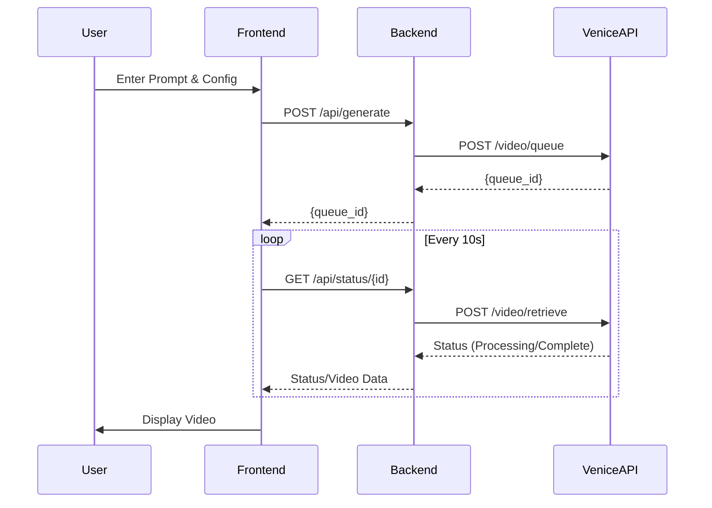

# PRD: Venice Music Video Studio

## 1. Overview
A web-based application for end-to-end music video creation leveraging the Venice AI Video Generation API. The app provides a high-end interface for queuing, tracking, and retrieving AI-generated video clips.

## 2. Objectives
- Provide a user-friendly interface for the complex asynchronous Venice AI workflow.
- Enable creators to generate cinematic visuals synced with audio.
- Maintain a simple, deployable architecture for Railway.

## 3. Features

### 3.1 Video Creation Suite
- **Model Selector**: Grouped by Text-to-Video and Image-to-Video.
- **Prompt Editor**: Rich text area for prompts with support for negative prompts.
- **Parameter Configuration**:
  - Duration (5s, 10s, etc.)
  - Aspect Ratio (16:9, 9:16, 1:1)
  - Resolution (480p, 720p, 1080p)
- **Reference Uploads**: Support for `image_url` (Image-to-Video) and `audio_url` (Background music).

### 3.2 Generation Management
- **Queue Dashboard**: List of active and past generation requests.
- **Live Progress**: Visual feedback using the `average_execution_time` and `execution_duration` from the API.
- **Cost Preview**: Integration with `/video/quote` to show USD cost before submission.

### 3.3 Media Gallery
- **Video Player**: In-app preview of generated MP4s.
- **Download Manager**: Easy download of completed assets.
- **Auto-Cleanup**: Toggle for `delete_media_on_completion`.

## 4. Technical Specification

### 4.1 Frontend
- **Framework**: React with Tailwind CSS for a modern, "beautiful" look.
- **State Management**: React Query or SWR for polling the `/video/retrieve` endpoint.
- **Components**: Lucide icons, Radix UI primitives for accessible components.

### 4.2 Backend (Simple Proxy)
- **Runtime**: Node.js (Express).
- **Purpose**: 
  - Securely store/inject the Venice API Key.
  - Proxy requests to `https://api.venice.ai/api/v1`.
  - Handle file uploads (if using data URLs for images/audio).
- **Deployment**: Railway-ready `Dockerfile` or `nixpacks` configuration.

### 4.3 API Integration Flow

## 5. Success Metrics
- Successful end-to-end generation in under 3 minutes.
- Zero API key exposure on the client side.
- Mobile-responsive design for on-the-go creation.
